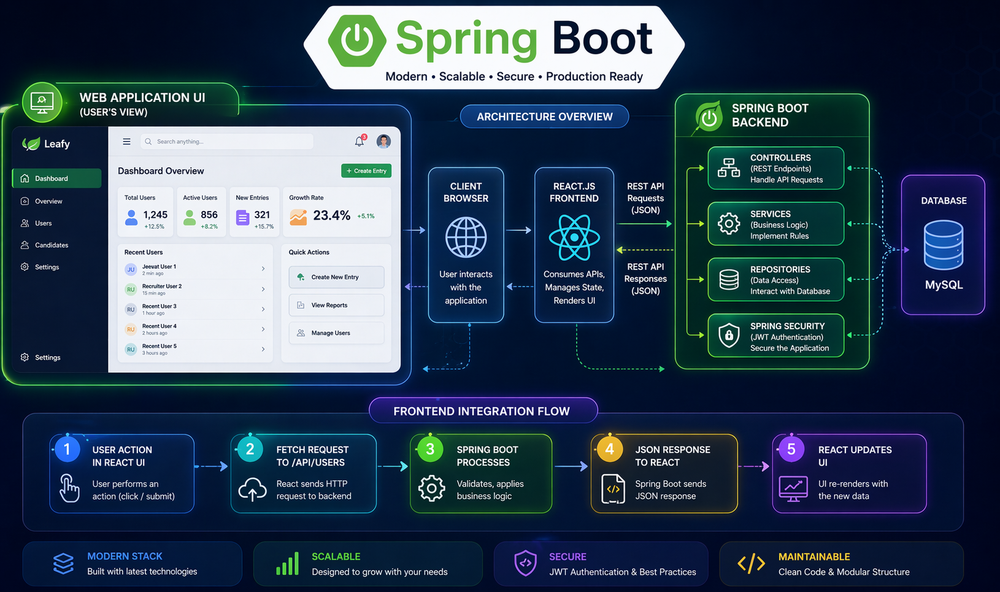

<h1 align="center">📊 Admin Dashboard System</h1>

A secure and scalable full-stack admin dashboard built using React, Spring Boot, and MySQL with REST API integration and JWT authentication

---

> 🚀 A production-style admin dashboard demonstrating secure REST API architecture, JWT authentication workflow, and modern frontend–backend integration.

## 🎯 Project Objective

The objective of this project is to design and develop a secure and scalable **Admin Dashboard System** that enables administrators to efficiently manage application data through a responsive frontend interface integrated with a structured Spring Boot backend.

The system demonstrates:

- REST API communication workflow
- layered backend architecture (Controller → Service → Repository)
- frontend interaction with backend services
- authentication and authorization using JWT
- relational database integration with MySQL

## 🚀 Project Overview

The **Admin Dashboard System** is a modern full-stack enterprise-style web application developed using **React.js**, **Spring Boot**, and **MySQL**.

It provides administrators with an interactive interface to manage users, monitor analytics, and perform system operations through a secure API-driven architecture.

Key architectural components include:

- React-based responsive UI layer
- Spring Boot REST API backend
- Controller → Service → Repository layered architecture
- JWT-based authentication and authorization
- MySQL relational database integration

This project reflects implementation of real-world enterprise dashboard development practices used in production-level applications.

## 📂 Project Structure

admin-dashboard/
│
├── frontend/ 
├── backend/ 
├── database/ 
├── banner.png 
├── architecture.png 
└── README.md 

## 🧠 System Architecture Workflow

React Frontend UI 
│
▼
REST API Communication 
│
▼
Spring Boot Backend 
│
▼
Service Layer Processing 
│
▼
Repository Layer 
│
▼
MySQL Database 

## ✨ Key Features

✅ Responsive admin dashboard interface  
✅ Secure REST API communication  
✅ JWT authentication workflow  
✅ Layered backend architecture  
✅ MySQL database integration  
✅ Modular scalable project structure
